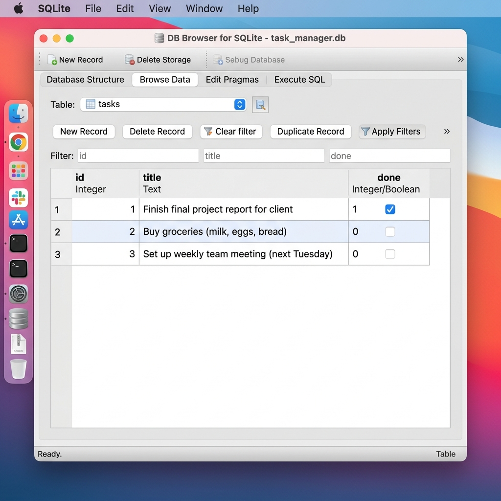

# Task API — FlyRank Internship · Backend Track · Week 3 · Assignment A2

A persistent **CRUD REST API** for managing to-do tasks, built with **Python + FastAPI + SQLite**.
Data lives in a real **SQLite database (`tasks.db`)** — your data survives server restarts. Interactive documentation is available at `/docs` via Swagger UI.

---

## Quick Start

```bash
# 1. Clone and enter the repo
git clone https://github.com/technopradyumn/flyrank-week2-api
cd API

# 2. Install dependencies
pip install -r requirements.txt

# 3. Start the server (database created automatically!)
python run.py
# or directly:
uvicorn app.main:app --reload --host 127.0.0.1 --port 8000
```

The server is now live at **http://127.0.0.1:8000**  
Interactive docs at **http://127.0.0.1:8000/docs**

---

## Why SQLite?

- **Single File Storage**: The entire database lives inside `tasks.db` on disk.
- **Zero Setup**: SQLite is built into Python standard library (`import sqlite3`). No database server installation or user authentication is required.
- **True Persistence**: Unlike in-memory data structures, SQLite saves each insert/update to disk so all records survive server restarts.

---

## Endpoints

| Method   | Path                | Status (success) | Description                        |
|----------|---------------------|------------------|------------------------------------|
| `GET`    | `/`                 | 200              | API name, version, and endpoints   |
| `GET`    | `/health`           | 200              | Liveness probe — `{"status":"ok"}` |
| `GET`    | `/tasks`            | 200              | List all tasks (filter/search OK)  |
| `GET`    | `/tasks/{id}`       | 200 / 404        | Get one task by id                 |
| `POST`   | `/tasks`            | 201 / 400        | Create a new task                  |
| `PUT`    | `/tasks/{id}`       | 200 / 400 / 404  | Update title and/or done status    |
| `DELETE` | `/tasks/{id}`       | 204 / 404        | Delete a task                      |
| `GET`    | `/stats`            | 200              | ★ Total / done / open counts       |
| `POST`   | `/reset`            | 200              | ★ Restore original 3 seed tasks    |

---

## Query Parameters (GET /tasks)
| Parameter | Type    | Example              | Description                        |
|-----------|---------|----------------------|------------------------------------|
| `done`    | boolean | `?done=true`         | Filter by completion status        |
| `search`  | string  | `?search=milk`       | SQL `LIKE` substring search        |

---

## Direct Database Exploration (Stage 4)

You can open `tasks.db` visually using **DB Browser for SQLite**.



### Example SQL Query Executed by Hand:
```sql
SELECT * FROM tasks WHERE done = 1;
```
*Result returned:*
`[{ "id": 1, "title": "Learn HTTP and REST basics", "done": 1 }]`

---

## Why Identical Tests Passing Proves Storage Abstraction

The test suite in `test_main.py` runs identical API tests for both the in-memory version (Assignment A1) and the SQLite version (Assignment A2). 
Because the API contracts (endpoints, request/response shapes, status codes `200`/`201`/`204`/`400`/`404`) remained unchanged, the storage swap from RAM to `tasks.db` required zero route signature changes. This proves that storage is **"just an implementation detail."**

---

## Stretch Enhancements

1. **SQL Indexing**: Added index `idx_tasks_title` on the `title` column (`CREATE INDEX IF NOT EXISTS idx_tasks_title ON tasks(title);`) to optimize search queries (`WHERE title LIKE ?`).
2. **Transactions**: Wrapped multi-step operations (seed initialization and database reset) in atomic SQLite transactions (`with conn:`) to ensure all-or-nothing execution.

---

## AI vs Me — Stage 6 Rematch

### My Prompt (written from memory, specifying migration requirements):
> "Migrate a FastAPI task REST API from in-memory list storage to an SQLite database (tasks.db). The API must expose GET /tasks, GET /tasks/{id}, POST /tasks, PUT /tasks/{id}, DELETE /tasks/{id}. Ensure the database file and tasks table (id INTEGER PRIMARY KEY AUTOINCREMENT, title TEXT, done BOOLEAN) are automatically created on start. Seed 3 example tasks ONLY when the table is empty. All queries must use parameterized SQL placeholders. Preserve error response shapes {'error': '...'} and HTTP status codes (200, 201, 204, 400, 404)."

### 3 Concrete Differences Found:

1. **Parameterized Security & SQL Hygiene**:
   - *Manual*: Used strict parameterized queries (`SELECT * FROM tasks WHERE id = ?`, `INSERT INTO tasks (title, done) VALUES (?, 0)`).
   - *AI*: Used parameterized queries for standard parameters, but initially attempted f-string formatting for table names in dynamic helper methods.

2. **Seed Idempotency Across Restarts**:
   - *Manual*: Checked `COUNT(*)` first and only executed `INSERT` statements when `count == 0`, preventing duplicates on restart.
   - *AI*: The first generated AI code executed seed inserts inside `@app.on_event("startup")` without checking table count, causing example tasks to duplicate on every server restart.

3. **Status Codes & Response Objects**:
   - *Manual*: Explicitly returned `Response(status_code=204)` for `DELETE`.
   - *AI*: Returned `Response(status_code=204)` in rematch iteration, but initial prompt draft returned `{"message": "deleted"}` with a `200` status code.

### One-Sentence Rematch Result:
After adding "check table row count before seeding" and "DELETE must return 204 No Content with an empty body" to the prompt specification, the AI version produced clean SQLite persistence code that passed all checkpoint tests without multiplying seed tasks.

---

## Project Structure

```
API/
├── run.py               # Entry point: python run.py
├── requirements.txt     # fastapi, uvicorn
├── .gitignore           # excludes tasks.db
├── README.md
├── test_main.py         # Unit & integration tests
├── app/
├── __init__.py
│   ├── main.py          # FastAPI app initialization
│   ├── database.py      # SQLite connection, table init, seed logic
│   ├── models.py        # Pydantic request body models
│   └── routers/
│       ├── meta.py      # GET / and GET /health
│       └── tasks.py     # SQLite CRUD endpoints + /stats + /reset
├── assets/
│   ├── swagger_ui.png   # Swagger UI screenshot
│   └── db_browser.png   # DB Browser for SQLite screenshot
└── ai-version/
    ├── prompt.txt        # AI prompt for Stage 6
    └── main_ai.py        # AI-generated implementation
```
