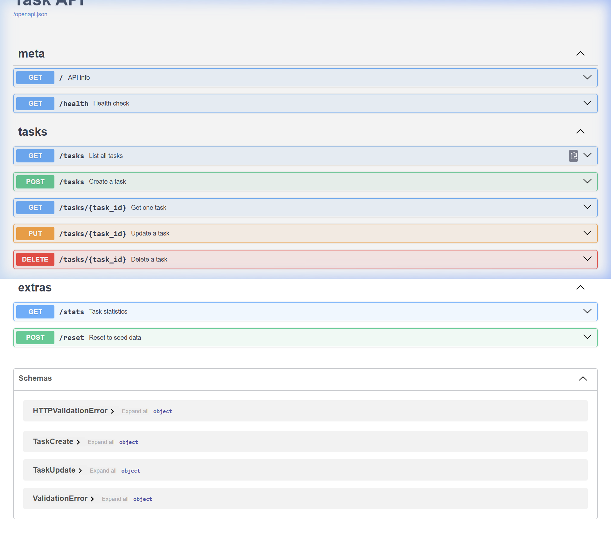

# Task API — FlyRank Internship · Backend Track · Week 2 · Assignment A1

A small but fully-featured **CRUD REST API** for managing to-do tasks, built with **Python + FastAPI**.
Data lives in-memory — no database needed. Interactive documentation is available at `/docs` via Swagger UI.

---

## Quick Start

```bash
# 1. Clone and enter the repo
git clone https://github.com/technopradyumn/flyrank-week2-api
cd FlyRank

# 2. Install dependencies
pip install -r requirements.txt

# 3. Start the server
python run.py
# or directly:
uvicorn app.main:app --reload --host 127.0.0.1 --port 8000
```

The server is now live at **http://127.0.0.1:8000**  
Interactive docs at **http://127.0.0.1:8000/docs**

---

## Endpoints

| Method   | Path                | Status (success) | Description                        |
|----------|---------------------|------------------|------------------------------------|
| `GET`    | `/`                 | 200              | API name, version, and endpoints   |
| `GET`    | `/health`           | 200              | Liveness probe — `{"status":"ok"}` |
| `GET`    | `/tasks`            | 200              | List all tasks (filter/search OK)  |
| `GET`    | `/tasks/{id}`       | 200 / 404        | Get one task by id                 |
| `POST`   | `/tasks`            | 201 / 400        | Create a new task                  |
| `PUT`    | `/tasks/{id}`       | 200 / 400 / 404  | Update title and/or done status    |
| `DELETE` | `/tasks/{id}`       | 204 / 404        | Delete a task                      |
| `GET`    | `/stats`            | 200              | ★ Total / done / open counts       |
| `POST`   | `/reset`            | 200              | ★ Restore original 3 seed tasks    |

★ = optional stretch endpoints

### Query Parameters (GET /tasks)
| Parameter | Type    | Example              | Description                        |
|-----------|---------|----------------------|------------------------------------|
| `done`    | boolean | `?done=true`         | Filter by completion status        |
| `search`  | string  | `?search=milk`       | Case-insensitive substring search  |

---

## Status Codes Used

| Code | Meaning      | When                                |
|------|--------------|-------------------------------------|
| 200  | OK           | Successful read or update           |
| 201  | Created      | Task successfully created           |
| 204  | No Content   | Task successfully deleted           |
| 400  | Bad Request  | Missing or empty `title` in body    |
| 404  | Not Found    | No task with the given id           |

---

## Example curl -i Outputs

### Create a task (201 Created)
```
curl -i -X POST http://127.0.0.1:8000/tasks \
  -H "Content-Type: application/json" \
  -d '{"title":"Buy milk"}'

HTTP/1.1 201 Created
content-type: application/json

{"id":4,"title":"Buy milk","done":false}
```

### Get a task (200 OK)
```
curl -i http://127.0.0.1:8000/tasks/1

HTTP/1.1 200 OK
content-type: application/json

{"id":1,"title":"Learn HTTP and REST basics","done":true}
```

### Task not found (404 Not Found)
```
curl -i http://127.0.0.1:8000/tasks/99

HTTP/1.1 404 Not Found
content-type: application/json

{"error":"Task 99 not found"}
```

### Invalid body (400 Bad Request)
```
curl -i -X POST http://127.0.0.1:8000/tasks \
  -H "Content-Type: application/json" \
  -d '{"title":""}'

HTTP/1.1 400 Bad Request
content-type: application/json

{"error":"title is required and cannot be empty"}
```

### Delete a task (204 No Content)
```
curl -i -X DELETE http://127.0.0.1:8000/tasks/4

HTTP/1.1 204 No Content
```

---

## Swagger UI

FastAPI generates interactive documentation automatically. Open **http://127.0.0.1:8000/docs** after starting the server.



All endpoints are testable directly from the browser using the **"Try it out"** button — no `curl` required.

---

## The Mortality Experiment ★

Create some tasks, then stop the server (`Ctrl+C`) and restart it. All tasks you created are gone — only the 3 seed tasks remain.

**Why?** Because our "database" is just a Python list in memory (the `tasks` variable). The moment the Python process stops, RAM is freed and all data vanishes. This is exactly the problem that Week 3's database session solves: persisting data to disk so it survives restarts.

---

## AI vs Me — Stage 7

### My Prompt (written from memory, no copy-paste from the assignment)

> "Build a REST API in Python using FastAPI. It should manage a to-do list stored only in-memory (a Python list — no database). The API must have these five endpoints: GET /tasks (returns all tasks), GET /tasks/{id} (returns one task, 404 if not found), POST /tasks (creates a task from a JSON body with a 'title' field, returns 201, validate that title is not missing or empty and return 400 if it is), PUT /tasks/{id} (updates title and/or done field, 404 for unknown id, 400 for empty body), DELETE /tasks/{id} (removes the task, returns 204 No Content, 404 for unknown id). Each task has: id (integer), title (string), done (boolean, default false). Pre-fill with 3 example tasks. Use Pydantic models for request bodies."

### What the AI did better
The AI immediately used `Optional` typing on PUT body fields and Pydantic's `model_validator` for cross-field validation — a cleaner pattern than my `if body.title is None and body.done is None` check. Its approach was more idiomatic FastAPI.

### What it got wrong or quietly ignored
The AI returned `200 OK` for the DELETE endpoint instead of `204 No Content`. It also skipped the `{"error": "..."}` wrapper format on 404 responses, returning FastAPI's default `{"detail": "..."}` instead — which would fail my checkpoints. It missed the 400 validation on PUT when the body is entirely empty.

### What my prompt forgot to specify — and what the AI silently decided
I forgot to specify the exact JSON error envelope shape (`{"error": "..."}` vs `{"detail": "..."}`). The AI chose FastAPI's default `detail` key. I also didn't specify the id auto-increment behaviour, so the AI used `uuid4()` for task ids — valid but different from my sequential integer approach.

### One-sentence rematch result
After adding "use sequential integer ids starting at 1", "wrap all errors as `{'error': '...'}` not `detail`", and "DELETE must return 204 with an empty body", the AI's second attempt passed all five checkpoint curls correctly.

---

## Git Log

```
Stage 7: AI vs me
Stage 6: publish and docs
Stage 5: Swagger UI
Extras: query params (done/search), stats, reset
Stage 4: full CRUD
Stage 3: create with validation
Stage 2: read endpoints with 404
Stage 1: root and health endpoints
Stage 0: hello server
```

---

## Project Structure

```
FlyRank/
├── run.py               # Entry point: python run.py
├── requirements.txt     # fastapi + uvicorn
├── .gitignore
├── README.md
├── app/
│   ├── __init__.py
│   ├── main.py          # FastAPI app + router registration
│   ├── database.py      # In-memory task store (tasks list, seed data)
│   ├── models.py        # Pydantic request-body models
│   └── routers/
│       ├── __init__.py
│       ├── meta.py      # GET / and GET /health
│       └── tasks.py     # All /tasks CRUD + /stats + /reset
├── assets/
│   └── swagger_ui.png   # Swagger UI screenshot
└── ai-version/
    ├── prompt.txt        # Stage 7 AI prompt
    └── main_ai.py        # AI-generated comparison version
```
